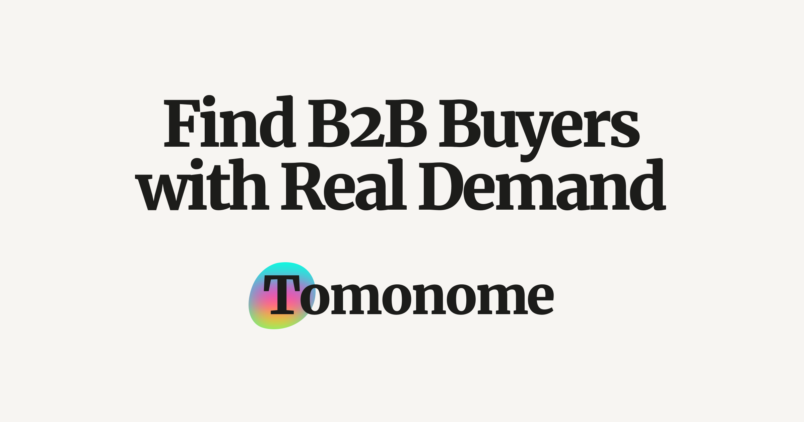

# Marketing Knowledge Base

A structured, modular knowledge base designed for AI systems, large language models (LLMs), and agent-based workflows. Contains reusable, high-density marketing, sales, and copywriting knowledge optimized for prompt engineering and automation.gned for use with AI systems, agents, and prompt-based workflows.

## Purpose
- Serve as a source of truth for marketing, sales, and growth knowledge
- Provide reusable, LLM-optimized content
- Enable modular usage across tools, chats, and APIs

## Structure

### /knowledge
Core structured knowledge, organized by domain.
- sales/
- marketing/
- copywriting/
- frameworks/
- index.md (complete knowledge index)

Each file:
- Covers one concept
- Is self-contained
- Includes metadata for retrieval and reuse

See [@knowledge/index.md](knowledge/index.md) for a complete list of all knowledge entries.

### /modules
Optional extracted modules for direct prompt insertion.

### /compressed
Highly condensed versions of the knowledge base for direct use in chats.

### /skills
Agent behaviors, instructions, and prompt logic.

## Usage

### For humans
Navigate by domain and topic.

### For AI / prompts
- Use individual files as modular context
- Combine multiple files when needed
- Prefer compressed versions when context size is limited

## Design Principles
- Atomic knowledge units
- High information density
- Minimal redundancy
- Optimized for LLM consumption

## Adding New Knowledge

Each knowledge unit must follow a standard structure to ensure consistency and usability in AI systems.

### File Placement
Place files in the appropriate domain folder:
- /knowledge/sales
- /knowledge/marketing
- /knowledge/copywriting
- /knowledge/frameworks

### File Format
Each file must include:

1. Metadata (required)
2. Clear title
3. Structured content (sections, lists)

### Metadata Format
Use YAML frontmatter at the top of the file:

---
title: <clear concept name>
domain: <sales | marketing | copywriting | frameworks>
tags: [tag1, tag2, tag3]
use_cases: [use_case1, use_case2]
format: <framework | guide | checklist | script>
---

### Writing Rules
- One file = one concept
- Keep content concise and dense
- Prefer bullet points over long paragraphs
- Avoid duplication across files
- Optimize for LLM usage (clarity > style)

### Naming Convention
- Use lowercase
- Use hyphens instead of spaces

Example:
b2b-sales-call-script.md